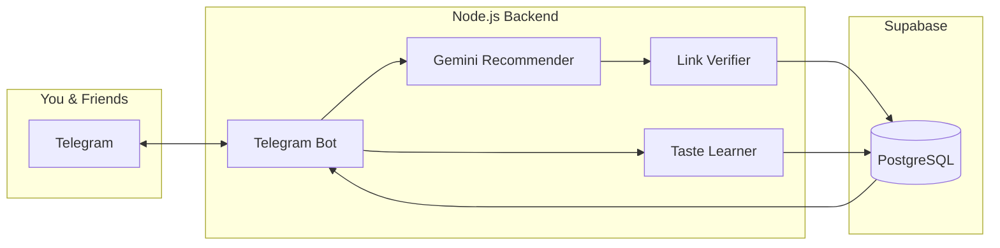

# CuriousMind - Final Implementation Plan

> **Status**: APPROVED

---

## Architecture: Telegram-First + Supabase



**Key decisions:**
- Fresh Node.js backend (no SPA shell)
- Supabase from Day 1 (multi-user ready)
- Porting: Gemini prompts + taste algorithm from Plan-2

---

## Project Structure

```
e:\Essai\
├── package.json
├── .env                      # API keys (gitignored)
├── src/
│   ├── config.js             # Environment config
│   ├── bot/
│   │   ├── index.js          # Bot entrypoint + polling
│   │   ├── commands.js       # /recommend, /preferences, /debug
│   │   └── callbacks.js      # Rating button handlers
│   ├── services/
│   │   ├── gemini.js         # Ported from Plan-2
│   │   ├── linkVerifier.js   # Puppeteer/fetch
│   │   ├── supabase.js       # DB operations
│   │   └── tasteLearner.js   # Ported from Plan-2
│   └── jobs/
│       └── scheduledPush.js  # Every 2 days
├── scripts/
│   └── setup-scheduler.ps1   # Windows Task Scheduler
└── docs/
```

---

## Bot Commands

| Command | Action |
|---------|--------|
| `/start` | Register user, welcome message |
| `/recommend` | Instant recommendation (no wait) |
| `/preferences` | Show your top 5 weighted tags |
| `/debug` | Show last Gemini response + verification status |
| `/pause` / `/resume` | Toggle scheduled pushes |

**Inline rating buttons** on every recommendation:
```
[⭐1] [⭐2] [⭐3] [⭐4] [⭐5] [Skip]
```

---

## Phased Implementation

### Phase 1: Core Pipeline (3-4 days)
- [ ] Project setup (Node.js, dependencies)
- [ ] Supabase schema + RLS policies
- [ ] Telegram bot with `/start`, `/recommend`
- [ ] Gemini integration (port prompt from Plan-2)
- [ ] Inline rating buttons → save to Supabase
- [ ] Basic link verification (HEAD request)

### Phase 2: Taste Learning + Scheduler (2 days)
- [ ] Port taste algorithm from Plan-2
- [ ] `/preferences` command
- [ ] Windows Task Scheduler (every 2 days)
- [ ] Inject top tags into Gemini prompt

### Phase 3: Multi-User & Polish (2 days)
- [ ] Friends can `/start` the bot
- [ ] Per-user preference isolation
- [ ] `/debug` command
- [ ] Better error handling

### Phase 4: Optional Web Dashboard (Deferred)
- [ ] View reading history
- [ ] Browse unread recommendations
- [ ] Admin controls

---

## Database Schema

```sql
-- Users
CREATE TABLE users (
    id UUID PRIMARY KEY DEFAULT gen_random_uuid(),
    telegram_id BIGINT UNIQUE NOT NULL,
    telegram_username TEXT,
    is_active BOOLEAN DEFAULT TRUE,
    receive_scheduled BOOLEAN DEFAULT TRUE,
    created_at TIMESTAMPTZ DEFAULT NOW()
);

-- Recommendations
CREATE TABLE recommendations (
    id UUID PRIMARY KEY DEFAULT gen_random_uuid(),
    title TEXT NOT NULL,
    author TEXT,
    url TEXT NOT NULL,
    description TEXT,
    reason TEXT,
    tags TEXT[],
    is_verified BOOLEAN DEFAULT FALSE,
    created_at TIMESTAMPTZ DEFAULT NOW()
);

-- User-Recommendation mapping
CREATE TABLE user_recommendations (
    user_id UUID REFERENCES users(id),
    recommendation_id UUID REFERENCES recommendations(id),
    telegram_message_id BIGINT,
    rating INTEGER CHECK (rating >= 0 AND rating <= 5),
    sent_at TIMESTAMPTZ DEFAULT NOW(),
    rated_at TIMESTAMPTZ,
    PRIMARY KEY (user_id, recommendation_id)
);

-- User preferences (taste weights)
CREATE TABLE user_preferences (
    user_id UUID REFERENCES users(id),
    tag TEXT NOT NULL,
    weight REAL DEFAULT 50.0,
    sample_count INTEGER DEFAULT 0,
    PRIMARY KEY (user_id, tag)
);
```

---

## Taste Learning Algorithm (Ported)

```javascript
// From Plan-2, adapted for Supabase
const impact = (rating - 3) * 2; 
// 5→+4, 4→+2, 3→0, 2→-2, 1→-4

// Per tag in the rated article:
newWeight = Math.max(0, Math.min(100, currentWeight + impact));
```

Simple but effective. Can enhance later with decay/recency.

---

## Verification Plan

| Phase | Test |
|-------|------|
| 1 | `/recommend` → message with buttons → tap rating → check Supabase |
| 2 | Rate 5+ articles → `/preferences` shows adjusted weights |
| 3 | Second user `/start` → isolated preferences |

---

## Tech Stack

| Component | Technology |
|-----------|------------|
| Runtime | Node.js 20+ |
| Bot | node-telegram-bot-api |
| AI | Gemini Flash (@google/genai) |
| Database | Supabase (PostgreSQL) |
| Link Check | axios + HEAD requests |
| Scheduler | Windows Task Scheduler |
