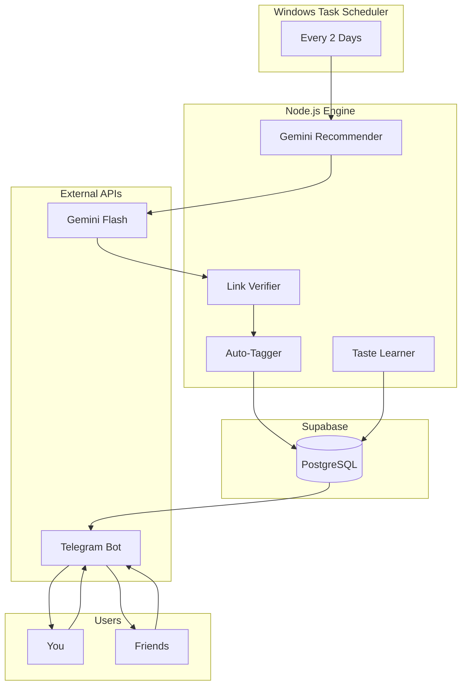

# Reading Recommendation Engine - Draft Plan

> **Status**: DRAFT - Pending approval before implementation

---

## Overview

A personal reading recommendation engine that:
- Runs every 2 days on Windows
- Uses Gemini Flash to find intellectually substantive content
- Verifies links actually work
- Sends recommendations via Telegram (with inline rating buttons!)
- Learns your taste over time from ratings
- Can be shared with friends

---

## Prerequisites

| Requirement | Status |
|------------|--------|
| Gemini API Key | ✅ Available (Windows env) |
| Telegram Bot Token | ✅ Available |
| Supabase Account | ⚠️ Needed (free tier) |

---

## Key Design Decisions

### Why Supabase is Now Recommended

Your new requirements change things:

| Feature | SQLite | Supabase |
|---------|--------|----------|
| Rate from Telegram | ✅ Works | ✅ Works |
| Share with friends | ❌ Not possible | ✅ Multi-user ready |
| Access from anywhere | ❌ Local only | ✅ Cloud |
| Effort | Simpler initially | Slightly more setup |

**Verdict**: Since you want to share with friends, **Supabase is the way to go**. The free tier (50K rows, unlimited API calls) is more than enough.

### Rating from Telegram (Simpler than Web UI!)

Instead of a separate web interface, we'll use Telegram's inline keyboards:

```
📚 New Recommendation

"On the Shortness of Life" by Seneca

A Stoic meditation on how we waste our lives on 
trivial pursuits. Written 2000 years ago but 
reads like it was written yesterday.

🏷️ philosophy, stoicism, classical, essay

🔗 Read: https://example.com/seneca

How would you rate this?
[⭐1] [⭐2] [⭐3] [⭐4] [⭐5] [Skip]
```

When you tap a rating, it saves to Supabase instantly. No web UI needed for basic use!

### Web UI Still Useful For:
- Viewing your full reading history
- Seeing your preference weights (what topics you like)
- Browsing past recommendations you haven't read
- Admin view if sharing with friends

---

## Architecture



---

## Technology Stack

| Component | Technology |
|-----------|-----------|
| Runtime | Node.js 20+ |
| Database | Supabase (PostgreSQL) |
| AI/LLM | Gemini Flash API |
| Bot & Ratings | Telegram Bot API (inline keyboards) |
| Web Dashboard | Vite + React (optional, for history/prefs) |
| Scheduler | Windows Task Scheduler |
| Link Verification | Puppeteer + fetch |

---

## Project Structure

```
e:\Essai\
├── package.json
├── .env.example
├── .env                          # API keys (gitignored)
├── README.md
│
├── src/
│   ├── config/
│   │   └── index.js              # Environment config
│   │
│   ├── services/
│   │   ├── gemini.js             # Recommendation generation
│   │   ├── linkVerifier.js       # URL verification
│   │   ├── telegram.js           # Bot + inline rating buttons
│   │   ├── supabase.js           # Database operations
│   │   ├── tagger.js             # Auto-tagging
│   │   └── tasteLearner.js       # Preference learning
│   │
│   ├── prompts/
│   │   └── recommendation.js     # Crafted prompts
│   │
│   ├── jobs/
│   │   ├── recommend.js          # Main job (every 2 days)
│   │   └── analyzePreferences.js # Monthly preference update
│   │
│   └── bot/
│       └── handlers.js           # Telegram callback handlers
│
├── web/                          # Optional dashboard
│   ├── package.json
│   └── src/
│
├── scripts/
│   ├── setup-scheduler.ps1
│   └── run-recommendation.bat
│
└── docs/
    └── PLAN.md                   # This file
```

---

## Database Schema

```sql
-- Users (for multi-user support)
CREATE TABLE users (
    id UUID PRIMARY KEY DEFAULT gen_random_uuid(),
    telegram_id BIGINT UNIQUE NOT NULL,
    telegram_username TEXT,
    is_active BOOLEAN DEFAULT TRUE,
    created_at TIMESTAMPTZ DEFAULT NOW()
);

-- Recommendations
CREATE TABLE recommendations (
    id UUID PRIMARY KEY DEFAULT gen_random_uuid(),
    title TEXT NOT NULL,
    author TEXT,
    url TEXT NOT NULL,
    description TEXT,
    why_interesting TEXT,
    source_type TEXT,
    verification_status TEXT DEFAULT 'pending',
    created_at TIMESTAMPTZ DEFAULT NOW()
);

-- Which recommendations sent to which users
CREATE TABLE user_recommendations (
    user_id UUID REFERENCES users(id),
    recommendation_id UUID REFERENCES recommendations(id),
    telegram_message_id BIGINT,
    sent_at TIMESTAMPTZ DEFAULT NOW(),
    PRIMARY KEY (user_id, recommendation_id)
);

-- Tags
CREATE TABLE tags (
    id UUID PRIMARY KEY DEFAULT gen_random_uuid(),
    name TEXT UNIQUE NOT NULL,
    category TEXT
);

-- Recommendation-Tags
CREATE TABLE recommendation_tags (
    recommendation_id UUID REFERENCES recommendations(id),
    tag_id UUID REFERENCES tags(id),
    PRIMARY KEY (recommendation_id, tag_id)
);

-- Ratings (per user per recommendation)
CREATE TABLE ratings (
    id UUID PRIMARY KEY DEFAULT gen_random_uuid(),
    user_id UUID REFERENCES users(id),
    recommendation_id UUID REFERENCES recommendations(id),
    score INTEGER CHECK (score >= 0 AND score <= 5),
    rated_at TIMESTAMPTZ DEFAULT NOW(),
    UNIQUE (user_id, recommendation_id)
);

-- User-specific tag preferences
CREATE TABLE user_tag_preferences (
    user_id UUID REFERENCES users(id),
    tag_id UUID REFERENCES tags(id),
    weight REAL DEFAULT 1.0,
    sample_count INTEGER DEFAULT 0,
    PRIMARY KEY (user_id, tag_id)
);
```

---

## Phased Implementation

### Phase 1: Core Pipeline ✨
- Gemini integration with crafted prompts
- Link verification
- Telegram bot with inline rating buttons
- Supabase storage (single user: you)
- Manual run: `node src/jobs/recommend.js`

### Phase 2: Polish Core + Multi-User
- Windows Task Scheduler automation
- Add friends via Telegram (they start the bot)
- Each user gets their own preference profile
- Better error handling

### Phase 3: Tagging & Taste Learning
- Auto-tagging recommendations via Gemini
- Per-user preference learning
- Monthly analysis job
- Preference transparency (bot command: `/mypreferences`)

### Phase 4: Optional Web Dashboard
- View reading history
- Browse unread recommendations  
- See preference weights visually
- Admin controls (if sharing broadly)

---

## Sharing with Friends

Simple flow:
1. Friend starts your Telegram bot
2. Bot registers them in `users` table
3. They receive same recommendations as you
4. Their ratings are tracked separately
5. Their preferences evolve independently

Optional controls:
- Approve new users before they get recommendations
- Remove inactive users
- See leaderboard of who's reading most 😄

---

## Verification Plan

| Phase | Test |
|-------|------|
| 1 | Run job → Get Telegram message → Tap rating → Check Supabase |
| 2 | Have friend start bot → Both receive recommendations |
| 3 | Rate 10+ items → Run analysis → Send `/mypreferences` → See weights |
| 4 | Open web dashboard → See history and preferences |

---

## Setup Steps (When Ready)

1. **Create Supabase Project** (5 min)
   - Go to supabase.com, create free account
   - Create new project, copy URL + anon key

2. **Create Telegram Bot** (2 min)
   - Message @BotFather on Telegram
   - `/newbot` → name it → copy token

3. **Configure .env** (1 min)
   - Add Gemini key, Telegram token, Supabase credentials

4. **Run Setup Script** (1 min)
   - Creates database tables
   - Verifies all connections

5. **Test First Recommendation** (2 min)
   - `node src/jobs/recommend.js`
   - Check Telegram for message with rating buttons

---

## Questions Resolved

| Question | Answer |
|----------|--------|
| Supabase or SQLite? | **Supabase** - needed for multi-user |
| Rate from Telegram? | **Yes!** Inline keyboards, very clean UX |
| Share with friends? | **Yes** - each gets own preference profile |

---

## Next Steps

Once you approve this plan, I'll implement Phase 1:
1. Set up project structure
2. Implement Gemini recommendation service
3. Implement link verification
4. Implement Telegram bot with rating buttons
5. Set up Supabase schema
6. Create the main recommendation job

**Ready when you are!**
